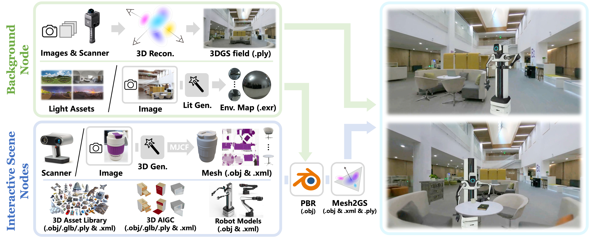

<h1 align="center">Real2Sim Asset Generation Tools for DISCOVERSE</h1>
<p align="center"><a href="https://drive.google.com/file/d/1637XPqWMajfC_ZqKfCGxDxzRMrsJQA1g/view?usp=sharing"></a>
<a href='https://air-discoverse.github.io/'></a>
</p>
<p align="center"></p>

DISCOVERSE unifies real-world captures, 3D AIGC, and any existing 3D assets in formats of 3DGS (.ply), mesh
(.obj/.stl), and MJCF physical models (.xml), enabling their use as interactive scene nodes (objects and robots) or the background node (scene). We use [3DGS](https://github.com/graphdeco-inria/gaussian-splatting) as a universal visual representation and integrate laser scanning, state-of-the-art generative
models, and physically-based relighting to boost the geometry and appearance fidelity of the reconstructed radiance fields.

## Installation
This repo is tested with Ubuntu 18.04+.

**To setup the Python environment for DiffusionLight (Step 3) & Mesh2GS (Step 5)**, run:
```bash
conda create -n mesh2gs python=3.10
conda activate mesh2gs
pip install torch torchvision torchaudio --index-url https://download.pytorch.org/whl/cu118 # replace your cuda version
pip install LitMesh2GS/submodules/diff-gaussian-rasterization
pip install LitMesh2GS/submodules/simple-knn
```
Please manually install other dependencies described in `requirements.txt`. 

**To setup the Python environment for TRELLIS (Step 1)**, we recommend to create a *new*, *separate* environment following the [official guidelines](https://github.com/microsoft/TRELLIS) to avoid any conflicts.

**Also, install [Blender](https://www.blender.org/) (recommended version: 3.1.2) for Step 4.** We strongly recommend running the related scripts (`blender_renderer/glb_render.py` and `blender_renderer/obj_render.py`) in the `Scripting` panel of the Blender executable. We do *NOT* recommend using [Blender Python API (bpy)](https://docs.blender.org/api/current/info_advanced_blender_as_bpy.html) due to version mismatch issues.

## Step 1: Image-to-3D Generation with [TRELLIS](https://github.com/microsoft/TRELLIS)
*Generate object-level interactive scene nodes as high-quality textured mesh from a single RGB image.*

**Firstly, capture one RGB image of the target object.** The object should locate at the center of the image and can not be too small (with an coverage larger than 50% pixels). Note that the object should *not* be necessarily captured in the exact scene for simulation, we only need to keep the background as *clean* as possible (easy for instance segmentation) and make the environmental lighting white, uniform, and bright.

**Then, run state-of-the-art image-to-3D generation approach to reconstruct textured mesh from the captured RGB image.**

- [TRELLIS](https://github.com/microsoft/TRELLIS) is the latest, open-source, state-of-the-art 3D generative model that generates high-quality textured meshes, 3DGSs, or radiance fields. We recommend to set up a new environment for TRELLIS and run image-to-3D generation following the [official guidelines](https://github.com/microsoft/TRELLIS). We recommend generating textured meshes as `.glb` files to be compatible with the subsequent lighting estimation, blender relighting, and Mesh2GS steps. **Note that, for a quick setup, if you do *NOT* want to align the appearance of the object with the background, you can directly generate 3DGS (`.ply`) assets for DISCOVERSE skipping Step3~5.**

- For 3D generation with higher quality, we recommend using the commercial software like [Deemos Rodin](https://hyper3d.ai/) ([CLAY](https://arxiv.org/abs/2406.13897)).

## Step 2: 3D Scene Reconstruction
*Reconstruct the background node as a 3DGS field using scanner or multi-view RGB captures.*

We recommend using [LixelKity K1 scanner](https://www.xgrids.cn/lixelk1) and [Lixel CyberColor](https://www.xgrids.cn/lcc) for generating high-quality 3DGS field to serve as the background node. In cases when the scanner is not available, you can use the [vanilla 3DGS](https://github.com/graphdeco-inria/gaussian-splatting) for scene reconstruction.

## Step 3: Lighting Estimation with [DiffusionLight](https://github.com/DiffusionLight/DiffusionLight)
*Estimate HDR environment map from a single RGB image, preparing for Step 4, i.e., the alignment between the object appearance and the reconstructed background node.*

**Note:** If you do *NOT* want to align the appearance of the object with the background, you can just download an arbitrary HDR map in `.exr` format from [PolyHeaven](https://polyhaven.com/hdris), and skip the following process and move to Step 4.

### Pretrained Weights for Huggingface Model
If you can not connect to [huggingface](https://huggingface.co/) due to VPN issues, please manually download the pretrained models from this [link](https://pan.baidu.com/s/1hVsfmpQav7DQQY3tdy9q-Q) (Code: 61i2). Then, manually modify the model paths (`SD_MODELS`, `VAE_MODELS`, `CONTROLNET_MODELS`, `DEPTH_ESTIMATOR`) in `DiffusionLight/relighting/argument.py` as the absolute path of your downloaded model folders.

### How to Run

**Firstly, prepare the input image(s).** Capture one RGB image for each target background and resize the input image(s) to **1024x1024**. To achieve this, we recommend *cropping* the image(s) to contain as much background information as possible. As an alternative, you can also *padding* the image(s) with a black border. 

Organize all the processed image(s) into a folder and specify the absolute path of the folder as `YourInputPath`. Specify `YourOutputPath` as a folder for saving your results. Then, run by:
```bash
cd DiffusionLight

python inpaint.py --dataset YourInputPath --output_dir YourOutputPath

python ball2envmap.py --ball_dir YourOutputPath/square --envmap_dir YourOutputPath/envmap

python exposure2hdr.py --input_dir YourOutputPath/envmap --output_dir YourOutputPath/hdr
```
And the final `.exr` results (saved in `YourOutputPath/hdr/`) will be used for the subsequent Blender PBR.

## Step 4: Physically-Based Relighting with Blender
*Render the mesh of the target object into multi-view images for 3DGS optimization, by uniformly sampling cameras on a sphere and performing (Pre-) physically-based relighting using Blender (bpy) with customized environment HDR map (distant lighting effects).*

Note that this is **NOT** the real PBR functionality, since it simply bakes the lighting to the SH appearance of the 3DGS to mimic the hue of the background scene. 

### Prepare `.exr` HDR Maps
Organize all the hdr maps for (Pre-)PBR into a single folder like:
```
YourHDRPath                          
├── hdr_name_0.exr
├── hdr_name_1.exr
├── hdr_name_2.exr
...
└── hdr_name_n.exr
```

### Render 3D Mesh Assets

#### For `.glb` Assets (e.g., Objaverse / Rodin Assets)
We strongly recommend using `.glb` 3D mesh assets similar to [objaverse](https://github.com/allenai/objaverse-xl). All of the `.glb` 3D assets to be converted should be put together into a single folder like:
```
YourInputPath                          
├── model_or_part_name_0.glb
├── model_or_part_name_1.glb
├── model_or_part_name_2.glb
...
└── model_or_part_name_n.glb
```

Then, paste and run `blender_renderer/glb_render.py` **in the `Scripting` panel of the Blender executable** and pass into the following arguments as:
```bash
--root_in_path YourInputPath 
--root_hdr_path YourHDRPath 
--root_out_path YourOutputPath
```
<!-- ```bash
python blender_renderer/glb_render.py --root_in_path YourInputPath --root_hdr_path YourHDRPath --root_out_path YourOutputPath
``` -->
The results will be saved at `YourOutputPath`, in which each folder (namely {hdr_name_i}_{model_or_part_name_i}) will store the rendered RGB images, depth maps, camera parameters, `.obj` geometry for one of the 3D models under one of the lightings. 

There are several other parameters to tune if the renderings are not satisfactory.
- `lit_strength`: strength of the environment lighting, a larger value leads to a brighter rendering.
- `lens`: focal length of the camera. If the object is too small in the rendering, i.e., too many pixels are wasting, try increasing this value. Otherwise, when only a fraction of the object is rendered, try decreasing it.
- `resolution`: rendering resolution, default value 512x512, a larger resolution leads to much slower rendering time.


#### For `.obj` Assets (e.g., Robot Models)
If you are dealing with `.obj` assets, e.g., robot models, each model will come with several texture and material maps, and the data should be organized into individual folders for each model, as the following:
```
YourInputPath                          
├── model_or_part_name_0
│   ├── obj_name_0.obj       
│   ├── mtl_name_0.mtl       
│   ├── tex_name_0.png       
│   └── ...                
├── model_or_part_name_1            
│   ├── obj_name_1.obj       
│   ├── mtl_name_1.mtl       
│   ├── tex_name_1.png       
│   └── ...                
├── model_or_part_name_2
...
└── model_or_part_name_n
```
The robot models developed by DISCOVER LAB, including MMK2, AirBot, DJI, RM2, etc., can be accessed through this [link](https://pan.baidu.com/s/1BW0GoDFmd0mPz9QItuJs7A) (Code: 94po).

Then, paste and run `blender_renderer/obj_render.py` **in the `Scripting` panel of the Blender executable** and pass into the following arguments as:
```bash
--root_in_path YourInputPath 
--root_hdr_path YourHDRPath 
--root_out_path YourOutputPath
```
<!-- Then, render by:
```bash
python blender_renderer/obj_render.py --root_in_path YourInputPath --root_hdr_path YourHDRPath --root_out_path YourOutputPath
``` -->
Note the parameter arguments are the same as `blender_renderer/glb_render.py`.


### Convert Cameras to COLMAP Convention
Convert the camera parameters from Blender rendering to the colmap formats by:
```bash
python blender_renderer/models2colmap.py --root_path YourOutputPath
```
Make sure to set the intrinsics (i.e., `--resolution`, `--lens`, `--sensor_size`) **strictly the same** when running `obj_render.py` / `glb_render.py` and `models2colmap.py`.

## Step 5: Mesh2GS
*Convert textured meshes to 3DGSs.*

Run Mesh2GS for each 3D asset one-by-one:
```bash
python LitMesh2GS/train.py -s YourOutputPath/model_or_part_name_i -m YourOutputPath/model_or_part_name_i/mesh2gs --data_device cuda --densify_grad_threshold 0.0002 -r 1
```
The 3DGS results will be saved at a new folder `mesh2gs` in `YourOutputPath/model_or_part_name_i` for each 3D asset.

Since 3DGS is memory-inefficient by nature, we recommend to specify `--densification_interval` to roughly control the amounts of the resulting 3DGS points. A larger value will lead to a sparser 3DGS field consuming less memory.